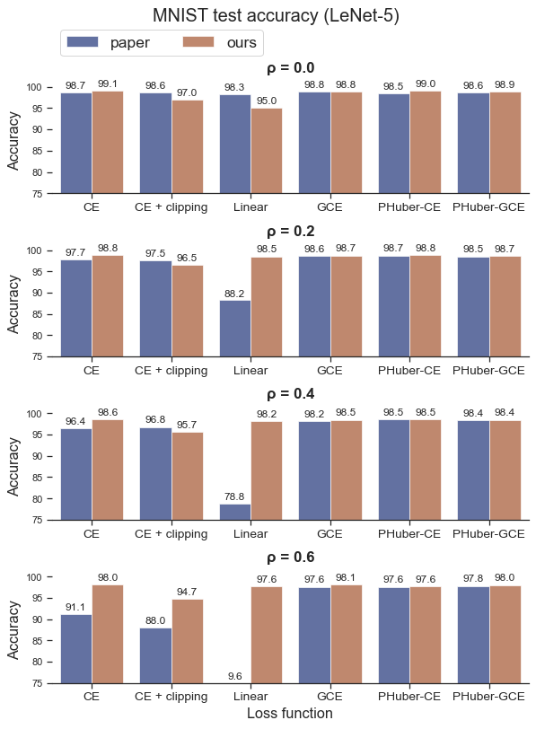
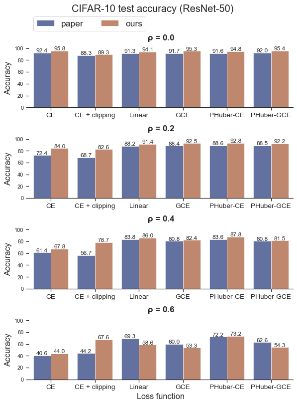
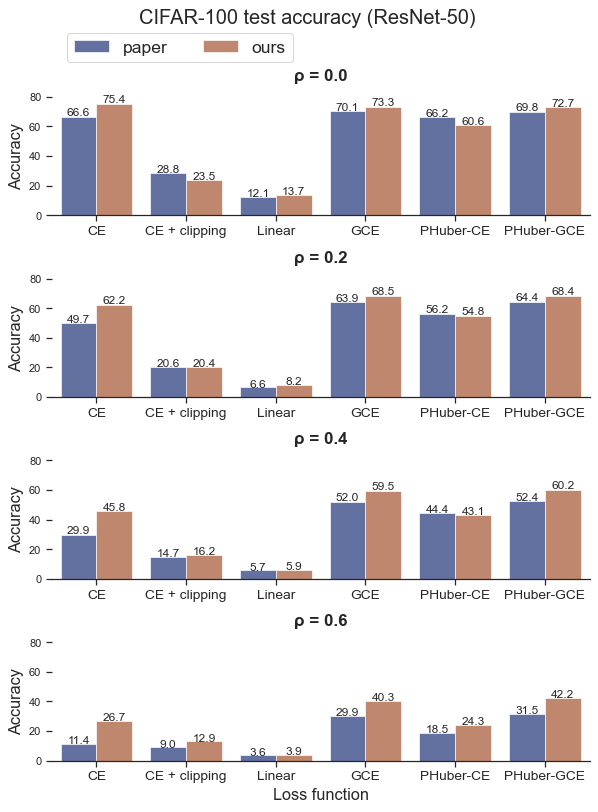

# Can gradient clipping mitigate label noise?

[](https://www.python.org/downloads/release/python-380//)
[](https://opensource.org/licenses/MIT)
[](https://github.com/psf/black)


A [PyTorch](https://pytorch.org/) implementation of the ICLR 2020 paper "[Can gradient clipping mitigate label noise?](https://openreview.net/pdf?id=rklB76EKPr)" by Menon et al.

This paper studies the robustness of gradient clipping to symmetric label noise, and proposes partially Huberised (PHuber) versions of standard losses, which perform well in the presence of label noise.

For the experiments, the following losses are also implemented:
- [Unhinged loss](https://arxiv.org/abs/1505.07634v1) (van Rooyen et al., NeurIPS 2015)
- [Generalized Cross Entropy loss](https://arxiv.org/abs/1805.07836v4) (Zhang & Sabuncu, NeurIPS 2018)


## Table of Contents
- [Dependencies](#dependencies)
- [Training](#training)
- [Evaluation](#evaluation)
- [Results](#results)
- [Pretrained models](#pretrained-models)
- [Synthetic experiments](#synthetic-experiments)
- [Project structure](#project-structure)
- [References](#references)


## Dependencies
This project requires Python >= 3.8. Dependencies can be installed with:
```
pip install -r requirements.txt
```


## Training

This project uses [Hydra](https://hydra.cc/) to configure experiments. Configurations can be overridden through config files (in `conf/`) and the command line. For more information, check out the [Hydra documentation](https://hydra.cc/docs/intro/).

With Hydra, configurations can be fully customized directly though the command line. To find out more about the configuration options, run:
```
python3 train.py --help
```

To run the experiments from the paper based on real-world datasets  (72 different configurations), only 5 arguments need to be provided:
- the dataset: `mnist, cifar10, cifar100` (e.g. `dataset=cifar100`)
- the model: `lenet, resnet50` (e.g. `model=resnet50`)
- the loss: `ce, gce, linear, phuber_ce, phuber_gce` (e.g. `loss=phuber_ce`)
- the label corruption probability ρ of the training set (e.g. `dataset.train.corrupt_prob=0.2`)
- the gradient clipping max norm (gradient clipping is not used by default) (e.g. `hparams.grad_clip_max_norm=0.1`)

**Note:** When choosing a dataset and model, the hyper-parameters (e.g. number of epochs, batch size, optimizer, learning rate scheduler, ...) are automatically changed to those used by the authors in their experiments. If needed, these hyper-parameters can also be overridden through command line arguments.

### Examples

Training LeNet on MNIST using cross-entropy loss and no label corruption:
```
python3 train.py dataset=mnist model=lenet loss=ce dataset.train.corrupt_prob=0.0
```

Training a ResNet-50 on CIFAR-10 using the partially Huberised cross-entropy loss (PHuber-CE) with τ=2, and label corruption probability ρ of 0.2:

```
python3 train.py dataset=cifar10 model=resnet50 loss=phuber_ce loss.tau=2 dataset.train.corrupt_prob=0.2
```

Training a ResNet-50 on CIFAR-100 using the Generalized Cross Entropy loss (GCE) and label corruption probability ρ of 0.6, with [mixed precision](https://pytorch.org/blog/accelerating-training-on-nvidia-gpus-with-pytorch-automatic-mixed-precision/):

```
python3 train.py dataset=cifar100 model=resnet50 loss=gce dataset.train.corrupt_prob=0.6 mixed_precision=true
```

 Training LeNet on MNIST using cross-entropy loss, and varying label corruption probability ρ (0.0, 0.2, 0.4 and 0.6). This uses [Hydra's multi-run flag](https://hydra.cc/docs/tutorials/basic/running_your_app/multi-run) for parameter sweeps:

```
python3 train.py --multirun dataset=mnist model=lenet loss=ce dataset.train.corrupt_prob=0.0,0.2,0.4,0.6
```

### Run metrics and saved models
By default, run metrics are logged to [TensorBoard](https://www.tensorflow.org/tensorboard). In addition, the saved models, training parameters and training log can be found in the run's directory, in `outputs/`.


## Evaluation

To evaluate a trained model using `eval.py`, you need to provide:
- the dataset: `mnist, cifar10, cifar100` (e.g. `dataset=cifar100`)
- the model: `lenet, resnet50` (e.g. `model=resnet50`)
- path to the trained model weights (e.g. `checkpoint=path/to/model.pt`)

For example, to evaluate a LeNet model trained on MNIST saved as `models/lenet.pt`, run:
```
python3 eval.py dataset=mnist model=lenet checkpoint=models/lenet.pt
```

By default, trained models are only evaluated on the test set. This can be modified by overriding the `dataset.train.use`, `dataset.val.use` and `dataset.test.use` arguments.

To find out more about the configuration options for evaluation, use the `--help` flag.

## Results

#### MNIST with LeNet-5

| Loss function   | ρ = 0.0   | ρ = 0.2   | ρ = 0.4   | ρ = 0.6   |
|:----------------|:----------|:----------|:----------|:----------|
| CE              | **99.1±0.1** | **98.8±0.0** | **98.6±0.0** | 98.0±0.1  |
| CE + clipping   | 97.0±0.0  | 96.5±0.0  | 95.7±0.1  | 94.7±0.1  |
| Linear          | 95.0±3.5  | 98.5±0.1  | 98.2±0.0  | 97.6±0.0  |
| GCE             | 98.8±0.0  | 98.7±0.0  | 98.5±0.0  | **98.1±0.0** |
| PHuber-CE τ=10  | 99.0±0.0  | 98.8±0.1  | 98.5±0.1  | 97.6±0.0  |
| PHuber-GCE τ=10 | 98.9±0.0  | 98.7±0.0  | 98.4±0.0  | 98.0±0.0  |



#### CIFAR-10 with ResNet-50
| Loss function   | ρ = 0.0   | ρ = 0.2   | ρ = 0.4   | ρ = 0.6   |
|:----------------|:----------|:----------|:----------|:----------|
| CE              | **95.8±0.1**  | 84.0±0.3  | 67.8±0.3  | 44.0±0.2  |
| CE + clipping   | 89.3±0.0  | 82.6±1.6  | 78.7±0.2  | 67.6±0.1  |
| Linear          | 94.1±0.1  | 91.4±0.5  | 86.0±2.4  | 58.6±5.2  |
| GCE             | 95.3±0.0  | 92.5±0.1  | 82.4±0.1  | 53.3±0.3  |
| PHuber-CE τ=2   | 94.8±0.0  | **92.8±0.2**  | **87.8±0.2**  | **73.2±0.2**  |
| PHuber-GCE τ=10 | 95.4±0.1  | 92.2±0.2  | 81.5±0.2  | 54.3±0.5  |



#### CIFAR-100 with ResNet-50

| Loss function   | ρ = 0.0   | ρ = 0.2   | ρ = 0.4   | ρ = 0.6   |
|:----------------|:----------|:----------|:----------|:----------|
| CE              | 75.4±0.3  | 62.2±0.4  | 45.8±0.9  | 26.7±0.1  |
| CE + clipping   | 23.5±0.2  | 20.4±0.4  | 16.2±0.5  | 12.9±0.1  |
| Linear          | 13.7±0.7  | 8.2±0.3   | 5.9±0.7   | 3.9±0.3   |
| GCE             | 73.3±0.2  | **68.5±0.3**  | 59.5±0.5  | 40.3±0.4  |
| PHuber-CE τ=10  | 60.6±1.1  | 54.8±1.2  | 43.1±1.1  | 24.3±0.8  |
| PHuber-GCE τ=10 | 72.7±0.1  | 68.4±0.1  | **60.2±0.2**  | **42.2±0.4**  |
| PHuber-CE τ=50  | **75.4±0.2**  | 65.9±0.2  | 49.1±0.2  | 26.9±0.0  |




## Pretrained models

For each configuration, the models obtained during the first trial are available on Google Drive:
- [Pretrained LeNet on MNIST](https://drive.google.com/drive/folders/1_sVDLPUqmIyRPMYD0tNTOR3V1PJATIJD?usp=sharing)
- [Pretrained ResNet-50 on CIFAR-100](https://drive.google.com/drive/folders/1Aas0q2LuaYr1ljHJXKTT4tIiwP0OzD3i?usp=sharing)


## Synthetic experiments

This repo also reproduces the experiments from the paper based on synthetic datasets. These experiments use simple linear models, which are implemented using NumPy and SciPy.  
To reproduce the first synthetic experiment (fig. 2a from the paper), run:
```
python3 synthetic_1.py
```
To reproduce the second synthetic experiment (fig. 2b from the paper), run:
```
python3 synthetic_2.py
```

## Project structure

The codebase is separated into 3 parts:

#### `phuber/`
This directory contains all the code related to the deep learning experiments on MNIST, CIFAR-10 and CIFAR-100, using PyTorch.   
This includes:
- Noisy MNIST, CIFAR-10 and CIFAR-100 dataset classes (with symmetric label noise), in `phuber/dataset.py`
- CE, Unhinged, GCE, PHuber-CE and PHuber-GCE losses, in `phuber/loss.py`
- LeNet-5 and ResNets in `phuber/network.py`


#### `synthetic/`
This directory contains all the code related to experiments on synthetic data with linear models, using NumPy and SciPy.


#### `conf/`
This directory contains all the Hydra config files for both types of experiments:
- Config files for Hydra settings (e.g. output folder and logger) are contained in `conf/hydra`.  
- Config files for the synthetic experiments are exclusively contained in `conf/synthetic`.  
- All the other files in this directory are for the deep learning experiments.


## References
- Menon et al., ["Can gradient clipping mitigate label noise?"](https://openreview.net/pdf?id=rklB76EKPr), ICLR 2020
- van Rooyen et al., ["Learning with Symmetric Label Noise: The Importance of Being Unhinged"](https://arxiv.org/abs/1505.07634v1), NeurIPS 2015
- Zhang & Sabuncu, ["Generalized Cross Entropy Loss for Training Deep Neural Networks with Noisy Labels"](https://arxiv.org/abs/1805.07836), NeurIPS 2018
- LeCun et al., ["Gradient-based learning applied to document recognition"](http://yann.lecun.com/exdb/publis/pdf/lecun-98.pdf), IEEE 1998
- He et al., ["Deep Residual Learning for Image Recognition"](https://arxiv.org/abs/1512.03385), CVPR 2016
